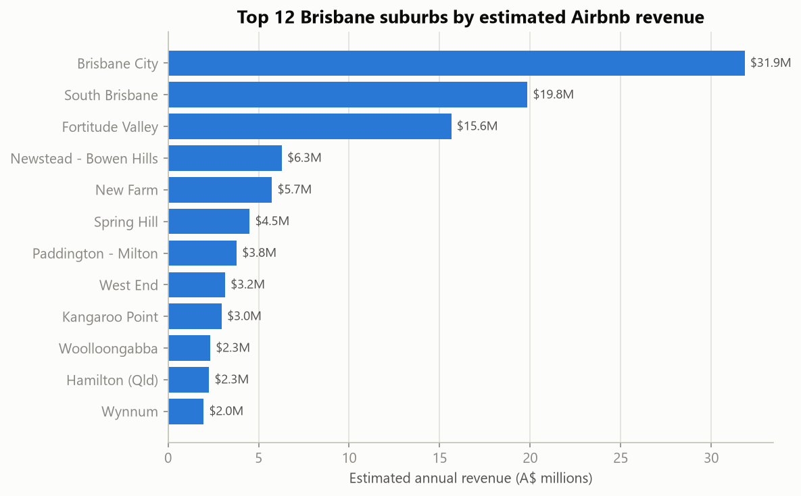
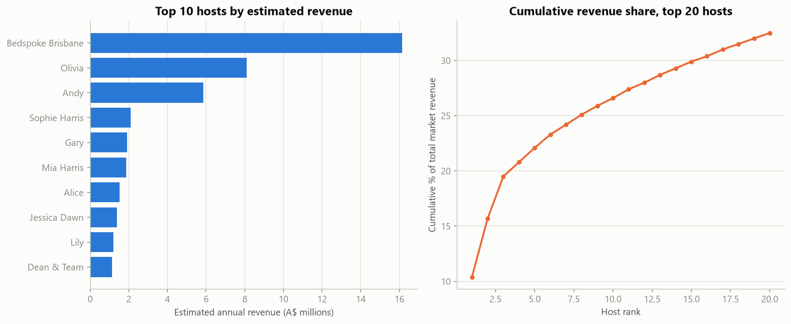

# Brisbane Airbnb Market Analysis (SQL)

**Who actually earns from Airbnb in Brisbane — individual hosts renting a spare room, or commercial-scale operators running rental portfolios?**

A SQL-first market analysis of Brisbane's short-term rental market, built on a 5-table relational database in PostgreSQL. The entire analysis — joins, CTEs, window functions — runs in SQL; Python is used only to execute the queries and chart the results.

---

## The Business Problem

Short-term rental platforms sit at the centre of Australia's housing-affordability debate — critics argue they pull long-term rental stock out of the market, while the tourism sector points to the revenue and visitor capacity they add, which matters directly for Brisbane as it scales up accommodation ahead of the **2032 Olympics**.

**The business question:** using real, public Airbnb data for Brisbane, is this a market of individuals renting out a spare room, or is it dominated by commercial-scale operators running rental portfolios — and what does that concentration mean for pricing, tourism supply, and the city's housing stock?

## My Approach

1. **Normalise the raw export into a relational schema** — `neighbourhoods`, `hosts`, `listings`, `calendar`, `reviews` — rather than analysing one wide flat file, so the analysis relies on real joins between tables.
2. **Investigate before trusting any number.** Confirmed which fields Airbnb had stopped publishing in this export (`host_since`, `license`, `instant_bookable` — all 100% empty), and manually inspected the top of the price distribution before deciding to exclude the top 1% as non-genuine "deterrent" prices (see `sql/03_business_analysis.sql` header).
3. **Answer 10 concrete business questions entirely in SQL** — revenue by suburb, price landscape, host-revenue concentration, the superhost effect, forward booking pace, portfolio-scale hosts, market growth, demand momentum, stay-length mix, and value-for-money listings — using `JOIN`, `CTE`s, `RANK()`, `ROW_NUMBER()`, `LAG()`, and running-total window functions.
4. **Be explicit about what the data can and can't say** — e.g. the `calendar` table is *forward-looking* availability (the 365 days after the scrape), not historical bookings, so it's used as a booking-pace signal rather than a confirmed occupancy trend.

## Key Findings

| Question | Finding |
|---|---|
| Market size | **A$154.6M** in estimated annual revenue across 6,358 active listings |
| Where's the money | **Brisbane City, South Brisbane and Fortitude Valley** alone account for ~44% of total estimated revenue |
| Who earns it | **658 multi-listing hosts (28% of hosts) capture 71.4% of all revenue**, vs. 28.6% for the 1,699 hosts with a single listing |
| Market concentration | The single largest host runs **286 listings** and earns **10.4%** of the entire market's revenue on its own; the **top 3 hosts alone control 19.5%** |
| The superhost effect | Superhosts get **~48% more booked nights/year** and earn **~31% more revenue** than regular hosts, at a higher average rating (4.88 vs 4.67) |
| Growth | New listings entering the market accelerated sharply — 668 (2023) → 968 (2024) → 1,573 (2025) — with 2026 already on a similar pace by the July scrape date |
| Stay-length mix | 88% of listings are genuine short-stay tourism (1–3 nights); **1.6% (99 listings) operate on 30+ night minimums — functionally standard leases, not short-term rentals** |

## Why This Matters More Than It Looks

The popular image of Airbnb is an individual renting a spare room. **The data says otherwise: more than two-thirds of Brisbane's estimated Airbnb revenue flows to hosts running two or more properties**, and the single largest operator alone earns more than one dollar in every ten the entire market generates. That's a materially different market structure than "the sharing economy" — closer to an unlicensed hotel and property-management sector operating inside residential suburbs. This is exactly the kind of finding a market analysis should surface plainly rather than assume away, and it's directly relevant to the current AU policy conversation about short-term rental regulation and housing supply.

## Business Recommendations

1. **Treat the top-line "average host" statistic with caution in any housing-supply debate** — revenue and listing counts are heavily concentrated in a small number of commercial operators, not evenly spread across individuals.
2. **Suburb-level growth, not just CBD volume, is where the market is moving** — review-based demand momentum is fastest in outer suburbs (e.g. Macgregor, Upper Kedron–Ferny Grove, Murarrie), suggesting short-term rental supply is expanding into areas that were previously purely long-term rental stock.
3. **The ~1.6% of listings on 30+ night minimum stays** are a small but identifiable segment worth separating from "true" tourism accommodation in any policy or tax discussion, since they function more like leases than short stays.

## Limitations

- `estimated_revenue_l365d` / `estimated_occupancy_l365d` are Inside Airbnb's own modeled figures (derived from price, calendar availability and review activity), not confirmed payouts or bookings.
- `calendar` covers only the 365 days *following* the scrape date — it shows forward booking/blocking pace, not a historical occupancy trend, and "unavailable" can mean host-blocked as well as booked.
- Growth figures (Q7) reflect the vintage mix of **listings still active today** — older listings that have since been delisted aren't counted, so true historical volume in earlier years was higher than shown.
- Single point-in-time snapshot (2026-07-14) — no comparison to prior years' Brisbane data in this analysis.

Full methodology, all 10 queries' results and references: **[executive_summary.md](executive_summary.md)**.

## Tools & Skills

`PostgreSQL` (joins, CTEs, window functions — `RANK()`, `ROW_NUMBER()`, `LAG()`, running totals) · relational schema design & ETL (raw CSV → staging → normalized schema) · `Python` (pandas, SQLAlchemy, matplotlib) for query execution and charting only · data-quality investigation (outlier detection, field-coverage checks) · translating SQL output into a business narrative.

## Repository Contents

| File | Description |
|---|---|
| [`airbnb_brisbane_market_analysis.ipynb`](airbnb_brisbane_market_analysis.ipynb) | Runs all 10 business-question queries against PostgreSQL and charts the results |
| [`executive_summary.md`](executive_summary.md) | Full write-up: methodology, results, interpretation, limitations, references |
| [`sql/01_schema.sql`](sql/01_schema.sql) | Final relational schema: `neighbourhoods`, `hosts`, `listings`, `calendar`, `reviews` |
| [`sql/02_transform_load.sql`](sql/02_transform_load.sql) | ETL: staging (raw text) → typed, cleaned, normalized tables |
| [`sql/03_business_analysis.sql`](sql/03_business_analysis.sql) | The 10 business-question queries, with data-scope notes |
| [`sql/00_staging_schema.sql`](sql/00_staging_schema.sql) | Staging tables matching the raw CSV columns 1:1 |

**Data:** [Inside Airbnb](https://insideairbnb.com), Brisbane QLD snapshot 2026-07-14 (public, free for non-commercial use). Raw CSVs (~120MB uncompressed) aren't committed to this repo; to reproduce, download `listings.csv.gz`, `calendar.csv.gz`, `reviews.csv.gz` and `neighbourhoods.csv` for Brisbane from [insideairbnb.com/get-the-data](https://insideairbnb.com/get-the-data/) and run the `sql/` scripts in order (`00` → `01` → `02` → `03`) against a local PostgreSQL database.

---

*Independent project, built to demonstrate SQL analysis skills for the Australian data analyst job market (SQL was the largest gap identified against real AU job postings — see repo owner's other two projects for Python/regression and time-series work). Data: Inside Airbnb, Brisbane QLD, 2026-07-14 snapshot.*
